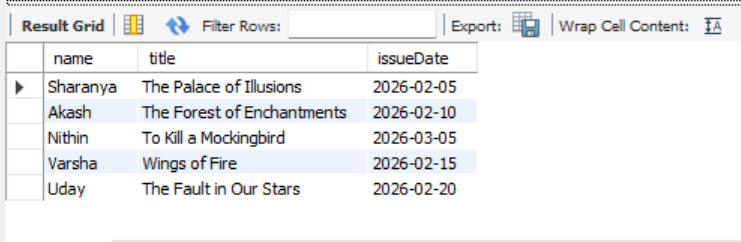
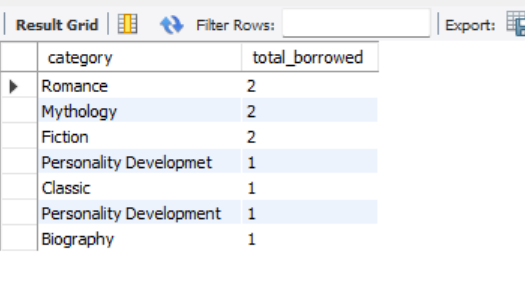
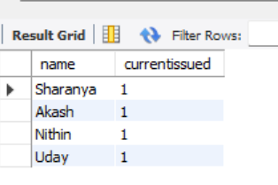

The Digital Library Audit System is a SQL-based project designed to manage and analyze book borrowing activities in a college library.
It helps track issued books, identify overdue returns, analyze popular categories, and manage inactive student records.

This project provides a structured database and queries to solve the below challenges efficiently.
Identifying overdue books, 
Tracking borrowing trends, 
Managing inactive users, 

Database Schema
Books
Stores information about books.

BookID (Primary Key)
Title
Author
Category

Students
Stores student details.

StudentID (Primary Key)
Name
Email
LastBorrowDate

IssuedBooks
Tracks borrowing transactions.

IssueID (Primary Key)
BookID (Foreign Key)
StudentID (Foreign Key)
IssueDate
ReturnDate

Overdue Logic

Most Borrowed Category

Students with Current Issued Books

